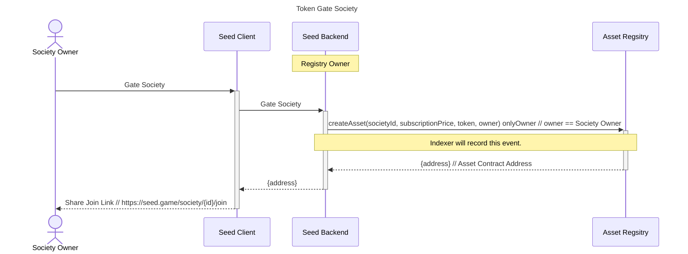
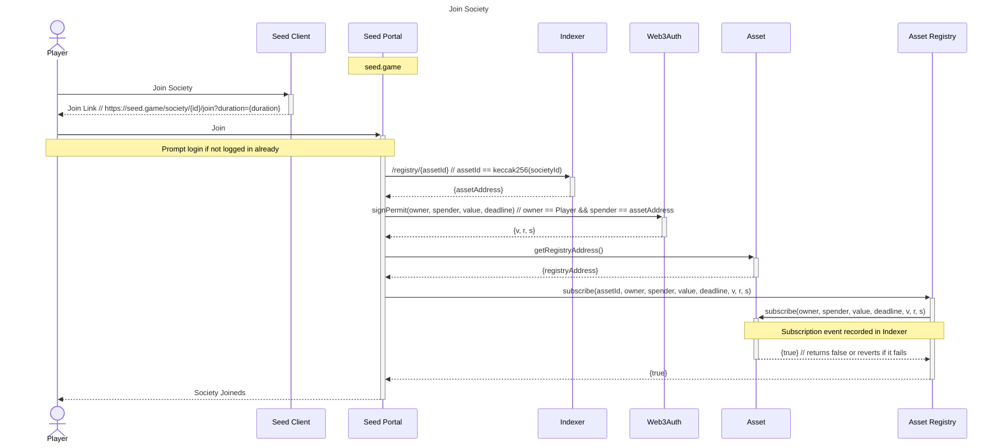
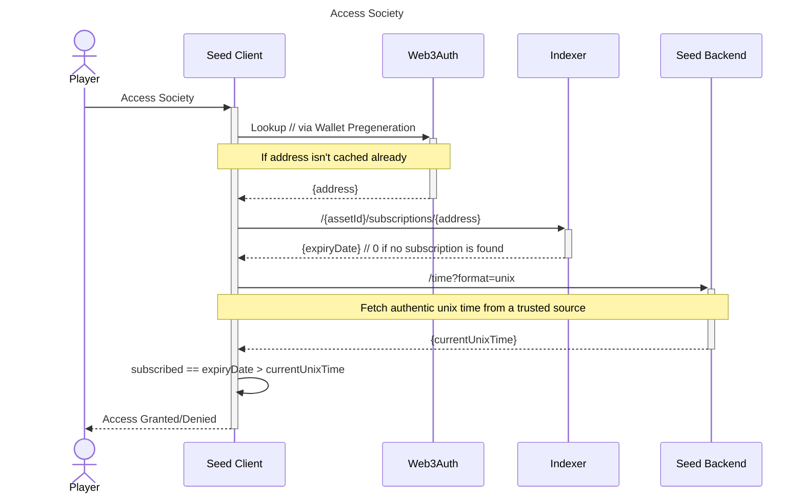

# Token Gate Society

```mermaid
sequenceDiagram
    title Token Gate Society
    actor Society Owner
    participant Seed Client
    participant Seed Backend
    Note over Seed Backend: Registry Owner
    participant Asset Regsitry
Society Owner->>+Seed Client: Gate Society
Seed Client->>+Seed Backend: Gate Society
Seed Backend->>+Asset Regsitry: createAsset(societyId, subscriptionPrice, token, owner) onlyOwner // owner == Society Owner
Note over Seed Backend, Asset Regsitry: Indexer will record this event.
Asset Regsitry-->>-Seed Backend: {address} // Asset Contract Address
Seed Backend-->>-Seed Client: {address}
Seed Client-->>-Society Owner: Share Join Link // https://seed.game/society/{id}/join
```
# Join Society

```mermaid
sequenceDiagram
    title Join Society
    actor Player
    participant Seed Client
    participant Seed Portal
    Note over Seed Portal: seed.game
    participant Indexer
    participant Web3Auth
    participant Asset
    participant Asset Registry
Player->>+Seed Client: Join Society
Seed Client-->>-Player: Join Link // https://seed.game/society/{id}/join?duration={duration}
Player->>+Seed Portal: Join
Note over Player, Seed Portal: Prompt login if not logged in already
Seed Portal->>+Indexer: /registry/{assetId} // assetId == keccak256(societyId)
Indexer-->>-Seed Portal: {assetAddress}
Seed Portal->>+Web3Auth: signPermit(owner, spender, value, deadline) // owner == Player && spender == assetAddress
Web3Auth-->>-Seed Portal: {v, r, s}
Seed Portal->>+Asset: getRegistryAddress()
Asset-->>-Seed Portal: {registryAddress}
Seed Portal->>+Asset Registry: subscribe(assetId, owner, spender, value, deadline, v, r, s)
Asset Registry->>+Asset: subscribe(owner, spender, value, deadline, v, r, s)
Note over Asset Registry, Asset: Subscription event recorded in Indexer
Asset-->>-Asset Registry: {true} // returns false or reverts if it fails
Asset Registry-->>-Seed Portal: {true}
Seed Portal-->>-Player: Society Joineds
```
# Access Society

```mermaid
sequenceDiagram
    title Access Society
    actor Player
    participant Seed Client
    participant Web3Auth
    participant Indexer
    participant Seed Backend
Player->>+Seed Client: Access Society
Seed Client->>+Web3Auth: Lookup // via Wallet Pregeneration
Note over Seed Client, Web3Auth: If address isn't cached already
Web3Auth-->>-Seed Client: {address}
Seed Client->>+Indexer: /{assetId}/subscriptions/{address}
Indexer-->>-Seed Client: {expiryDate} // 0 if no subscription is found
Seed Client->>+Seed Backend: /time?format=unix
Note over Seed Client, Seed Backend: Fetch authentic unix time from a trusted source
Seed Backend-->>-Seed Client: {currentUnixTime}
Seed Client->>Seed Client: subscribed == expiryDate > currentUnixTime
Seed Client-->>-Player: Access Granted/Denied
```