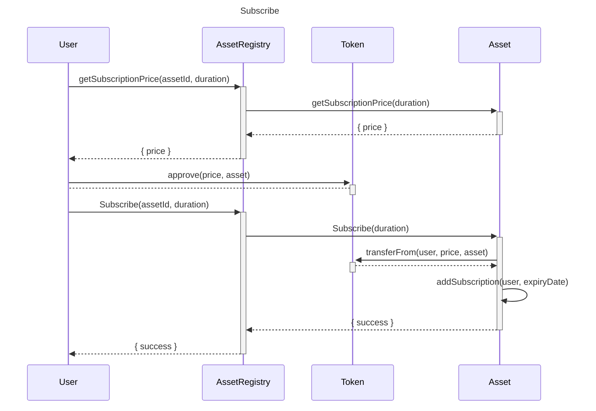
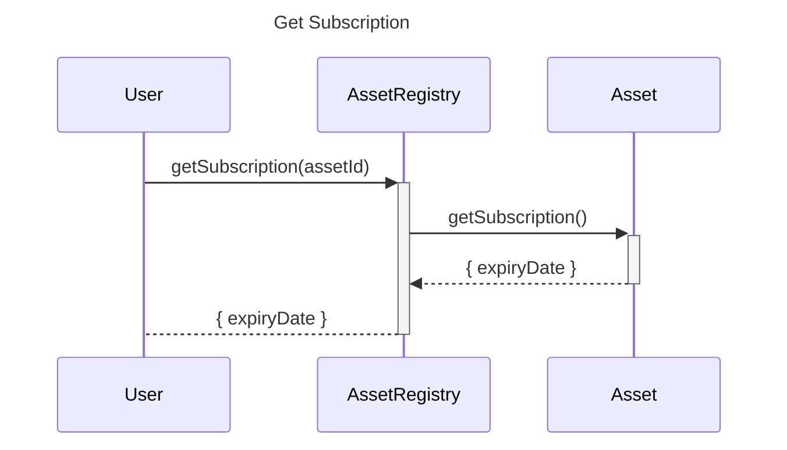
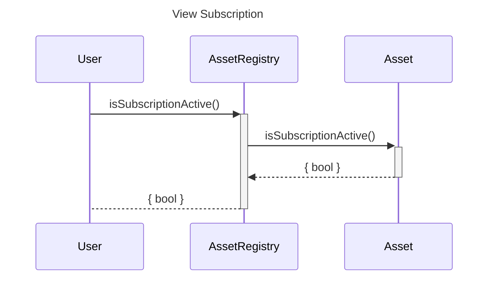
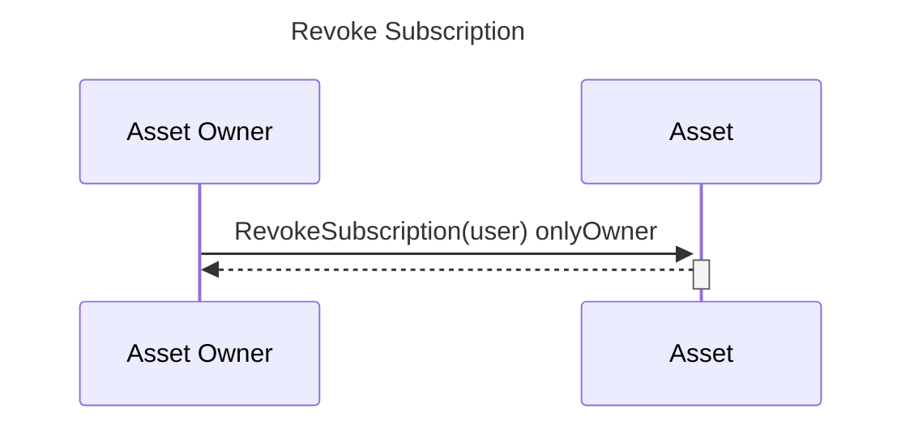
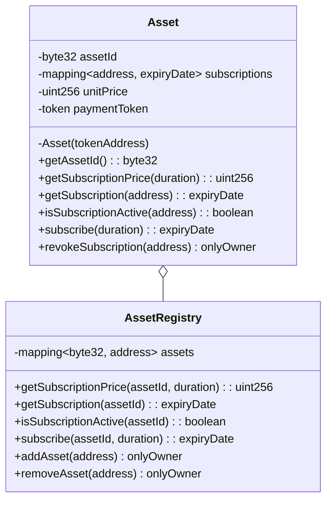

# MVP
## Flow Design
### Subscribe

```mermaid
sequenceDiagram
title Subscribe
    participant User
    participant AssetRegistry
    participant Token
    participant Asset

User->>+AssetRegistry: getSubscriptionPrice(assetId, duration)
AssetRegistry->>+Asset: getSubscriptionPrice(duration)
Asset-->>-AssetRegistry: { price }
AssetRegistry-->>-User: { price }
User->>+Token: approve(price, asset)
Token-->-User:
User->>+AssetRegistry: Subscribe(assetId, duration)
AssetRegistry->>+Asset: Subscribe(duration)
Asset->>+Token: transferFrom(user, price, asset)
Token-->>-Asset:
Asset->>Asset: addSubscription(user, expiryDate)
Asset-->>-AssetRegistry: { success }
AssetRegistry-->>-User: { success }
```

### Subscription

```mermaid
sequenceDiagram
title Get Subscription
    participant User
    participant AssetRegistry
    participant Asset

User->>+AssetRegistry: getSubscription(assetId)
AssetRegistry->>+Asset: getSubscription()
Asset-->>-AssetRegistry: { expiryDate }
AssetRegistry-->-User: { expiryDate }
```

```mermaid
sequenceDiagram
title View Subscription
    participant User
    participant AssetRegistry
    participant Asset

User->>+AssetRegistry: isSubscriptionActive()
AssetRegistry->>+Asset: isSubscriptionActive()
Asset-->>-AssetRegistry: { bool }
AssetRegistry-->-User: { bool }
```

### Revoke Subscription

```mermaid
sequenceDiagram
title Revoke Subscription
    participant Asset Owner
    participant Asset

Asset Owner->>+Asset: RevokeSubscription(user) onlyOwner
Asset-->>-Asset Owner:
```

## Architecture

```mermaid
classDiagram
    Asset o-- AssetRegistry
    class AssetRegistry{
        -mapping~byte32, address~ assets
        +getSubscriptionPrice(assetId, duration) : uint256
        +getSubscription(assetId) : expiryDate
        +isSubscriptionActive(assetId) : boolean
        +subscribe(assetId, duration) : expiryDate
        +addAsset(address) onlyOwner
        +removeAsset(address) onlyOwner
    }
    class Asset{
        -byte32 assetId
        -mapping~address, expiryDate~ subscriptions
        -uint256 unitPrice
        -token paymentToken
        -Asset(tokenAddress)
        +getAssetId() : byte32
        +getSubscriptionPrice(duration) : uint256
        +getSubscription(address) : expiryDate
        +isSubscriptionActive(address) : boolean
        +subscribe(duration) : expiryDate
        +revokeSubscription(address) onlyOwner
    }
```