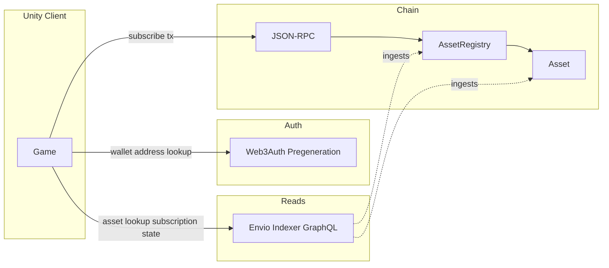

# Open Creator Rails – Unity Integration

This document explains how to integrate **Open Creator Rails (OCR)** into a Unity environment. It covers deployment data, resolving assets and subscriptions via the indexer, checking entitlements, and performing permit-based subscribe via RPC. For high-level flows, it references the [Klang integration flows](klang-integration-flows.md).

---

## 1. Introduction and prerequisites

### What is Open Creator Rails?

Open Creator Rails is a minimal, verifiable on-chain primitive for managing access to game resources using **expiration-based entitlements**. The system maps `[subject, resourceId] → expirationTime`, enabling creator monetization use cases like an "on-chain Patreon."

- **Architecture**: See the [README](../README.md) and [MVP Architecture and Design](mvp-design-and-architecture.md) for flow diagrams and contract design.
- **Contracts**: [AssetRegistry](../src/AssetRegistry.sol) deploys and indexes [Asset](../src/Asset.sol) contracts; subscriptions are paid via ERC-2612 (permit) and stored as expiry timestamps per user per asset.

### Prerequisites for Unity

- A Unity project targeting your chosen platform (e.g. standalone, WebGL).
- **Network**: Choose a chain (e.g. Sepolia); you need its chain ID and an RPC URL for **writes** (e.g. `subscribe`).
- **Indexer**: An [Envio](https://envio.dev/) HyperIndex (or equivalent) endpoint for **all read operations** (asset lookup, subscription state). Do not rely on direct RPC for these reads in production.
- **Web3Auth** (or equivalent): For embedded wallets and [wallet pregeneration](https://docs.metamask.io/embedded-wallets/features/wallet-pregeneration) when you need a user’s address without full login (e.g. Access Society flow).

---

## 2. High-level flows (reference Klang doc)

The three flows below are described in detail in [klang-integration-flows.md](klang-integration-flows.md). Here we summarize how they map to Unity.

### Token Gate Society (gate / create asset)

**Flow**: A society owner gates a society; a backend (acting as registry owner) creates an asset on-chain; the indexer ingests the event; the client can share a join link.

- **In Unity**: The "Society Owner" may be represented by your game backend. The actual **registry deployment** and **asset creation** are typically done **outside Unity** (e.g. via scripts or your backend), because only the registry owner can call `createAsset`.
- **References**: [script/deployRegistry.sh](../script/deployRegistry.sh), [script/createAsset.sh](../script/createAsset.sh). The indexer records `AssetCreated`; after that, clients resolve the asset via the indexer (see Join Society).

### Join Society (subscribe)

**Flow**: Player follows a join link; the client resolves the asset via the **indexer**, gets a permit signature from the user’s wallet (Web3Auth), then sends a **subscribe** transaction to the AssetRegistry.

1. **Resolve asset**: Call the **indexer** (e.g. GraphQL or REST `registry/{assetId}`) with `assetId = keccak256(societyId)` (or the human-readable id if your indexer accepts it and hashes internally). Response: `assetAddress`.
2. **Registry address**: Either from your deployment config (see [Deployment and contract addresses](#3-deployment-and-contract-addresses)) or via one RPC read: `Asset.getRegistryAddress()` on `assetAddress`.
3. **Permit**: User signs an ERC-2612 permit (owner = user, spender = `assetAddress`, value, deadline). Use Web3Auth/embedded wallet to obtain signature components `v`, `r`, `s`.
4. **Subscribe (RPC write)**: Send a transaction to the registry:  
   `AssetRegistry.subscribe(assetId, owner, spender, value, deadline, v, r, s)`.  
   The indexer will ingest `SubscriptionAdded` from the Asset contract.

**References**: [script/subscribe.sh](../script/subscribe.sh) (full flow), [script/Utils.s.sol](../script/Utils.s.sol) (permit signing: PERMIT_TYPEHASH, nonce, DOMAIN_SEPARATOR, EIP-712 digest).

### Access Society (check entitlement)

**Flow**: Player opens the game; client determines if they have an active subscription for the society (asset) without requiring a full wallet login.

1. **User address**: Use **Web3Auth Wallet Pregeneration** to get the wallet address for the user (e.g. by verifierId/email). See [Web3Auth wallet pregeneration](#5-web3auth-wallet-pregeneration).
2. **Subscription state**: Call the **indexer** (e.g. `/{assetId}/subscriptions/{address}` or equivalent GraphQL) to get `expiryDate` (Unix timestamp; 0 if no subscription).
3. **Current time**: Fetch trusted current Unix time from your backend (e.g. `GET /time?format=unix`) to avoid client clock manipulation.
4. **Decision**: Access granted if `expiryDate > currentUnixTime`.

---

## 3. Deployment and contract addresses

### Registries and assets

Deployments are stored in **`registries_<chain_id>.json`** at the repo root (e.g. [registries_11155111.json](../registries_11155111.json) for Sepolia). The file is updated when registries or assets are (re)deployed; new deployments appear in the same file.

**Structure**:

- Top level: array of registry objects.
- Each registry: `address`, `creatorFeeShare`, `registryFeeShare`, `owner`, `assets`.
- Each entry in `assets`: `address`, `assetId`, `assetIdHash`, `subscriptionPrice`, `tokenAddress`, `owner`.

**Important**: In JSON, `assetId` is the **human-readable string** (e.g. `"default_asset_id"`). On-chain and for contract calls you use the **bytes32** `assetIdHash = keccak256(assetId)`. The scripts use `cast keccak "default_asset_id"` to obtain it; in Unity you need a Keccak256 implementation over the UTF-8 bytes of the string.

### Test tokens

Test ERC-20 tokens that support ERC-2612 (permit) are listed in [token_addresses.json](../token_addresses.json), keyed by **chain ID** (e.g. `11155111` for Sepolia, `84532` for Base Sepolia). Anyone can mint them for testing.

- **Mint**: See README section "Test Tokens" and [script/mintTestToken.sh](../script/mintTestToken.sh).
- **Deploy a new test token**: [script/deployTestToken.sh](../script/deployTestToken.sh) (writes the new address into `token_addresses.json` for the current chain).

---

## 4. Indexer (Envio) – all read calls

**All read operations** (resolve asset by id, get subscription expiry for a user) should go through the **indexer**, not direct RPC. This keeps reads fast and consistent and avoids overloading the chain.

- **Envio**: [Envio](https://envio.dev/) provides [HyperIndex](https://docs.envio.dev/docs/HyperIndex/overview), a multichain indexer with a GraphQL API that ingests contract events.
- **OCR events**: The indexer implementation ingests at least:
  - `AssetRegistry.AssetCreated`
  - `Asset.SubscriptionAdded`
  - `Asset.SubscriptionRevoked`
  Optionally: `Asset.SubscriptionPriceUpdated`, registry fee-share updates.

**Expected API shape for Unity** (to be provided by the indexer deployment):

- **Resolve asset by id**: e.g. GraphQL query or REST such as `registry/{assetId}` (or by assetId hash). Response: `assetAddress`.
- **Subscription state**: e.g. GraphQL or REST such as `{assetId}/subscriptions/{address}`. Response: `expiryDate` (Unix timestamp; 0 if no subscription).

**In Unity**: Use `UnityWebRequest` to send an HTTP POST (GraphQL with JSON body) or GET to the indexer endpoint, then parse the JSON response for `assetAddress` or `expiryDate`.

---

## 5. Web3Auth wallet pregeneration

[Wallet Pregeneration](https://docs.metamask.io/embedded-wallets/features/wallet-pregeneration) lets you create or look up a wallet address by a **verifierId** (e.g. email or your unique user id) **without** the user logging in. This is used in the **Access Society** flow to get the user’s wallet address so you can query the indexer for their subscription expiry.

**Implementation steps** (from MetaMask/Web3Auth docs):

1. **Identify the user**: Decide the unique identifier (verifierId) in your system (e.g. email or internal id).
2. **Call the pregeneration API**: Use the Web3Auth/MetaMask Embedded Wallets API with your Verifier Name, Web3Auth Network, and Client Id (from the dashboard).
3. **Receive wallet address**: The API returns the wallet address for that user, usable when they later log in.

Use this address only for **read-only** checks (e.g. indexer subscription lookup). For signing (e.g. permit in Join Society), the user must authenticate and sign with that wallet via your Web3Auth/embedded-wallet integration.

---

## 6. Unity implementation notes

### HTTP layer

Use **`UnityWebRequest`** for:

- **Indexer**: GraphQL (POST with JSON body containing `query` and optionally `variables`) or REST-style GET, depending on how the indexer API is exposed.
- **RPC**: POST to your `RPC_URL` with a JSON-RPC body (e.g. `eth_call` for reads, `eth_sendTransaction` for the subscribe transaction).

No special SDK is required for these HTTP calls; standard Unity networking is sufficient.

### Writes from Unity

The only on-chain **write** needed from the Unity client is **subscribe**:

- **Contract**: `AssetRegistry.subscribe(bytes32 assetId, address owner, address spender, uint256 value, uint256 deadline, uint8 v, bytes32 r, bytes32 s)`.
- **Spender**: Must be the **asset contract address** (from the indexer).
- **Owner**: The subscribing user (same as the signer of the permit).
- **Value / deadline / v, r, s**: From the ERC-2612 permit signed by the user. The user must hold enough ERC-20 (e.g. test token); value is in the token’s smallest unit and should be a multiple of the asset’s subscription price (excess is rounded down on-chain).

Encode the call data (function selector + ABI-encoded arguments) and send via `eth_sendTransaction`; the sender must have gas and be the same as `owner` for the permit to apply.

### Permit (ERC-2612) in Unity

Replicate the logic in [script/Utils.s.sol](../script/Utils.s.sol):

- **PERMIT_TYPEHASH**: `keccak256("Permit(address owner,address spender,uint256 value,uint256 nonce,uint256 deadline)")`.
- **Nonce**: Read from the token contract via `eth_call`: `nonces(address owner)`.
- **Deadline**: e.g. `currentTime + duration` (same duration as in the script, or your chosen validity window).
- **Struct hash**: `keccak256(abi.encode(PERMIT_TYPEHASH, owner, spender, value, nonce, deadline))`.
- **EIP-712 digest**: `keccak256("\x19\x01" || DOMAIN_SEPARATOR || structHash)`. Get `DOMAIN_SEPARATOR` from the token via `eth_call` if not provided by your auth SDK.
- **Sign**: Use Web3Auth or your embedded-wallet SDK to sign the digest and obtain `v`, `r`, `s`.

Then pass `owner`, `spender` (asset address), `value`, `deadline`, `v`, `r`, `s` into `AssetRegistry.subscribe`.

### Asset id hashing

On-chain, the asset is identified by **bytes32** = `keccak256(assetIdString)`. In C#, use a Keccak256 library (e.g. Nethereum or a small Keccak implementation) and hash the UTF-8 bytes of the human-readable asset id string. Ensure the result is 32 bytes and passed as a 0x-prefixed hex string in the ABI-encoded call.

### Time and access control

For **Access Society**, always compare the indexer’s `expiryDate` with **trusted server time** (e.g. from your backend `GET /time?format=unix`). Do not rely on the client’s clock to prevent users from extending access by changing their device time.

---

## 7. Scripts as reference

| Script | Purpose |
|--------|--------|
| [script/deployRegistry.sh](../script/deployRegistry.sh) | Deploy a new AssetRegistry (creator/registry fee shares). |
| [script/createAsset.sh](../script/createAsset.sh) | Create an asset in a registry (registry owner only). |
| [script/subscribe.sh](../script/subscribe.sh) | Full subscribe flow: get asset, get token, sign permit, send subscribe. |
| [script/utils.sh](../script/utils.sh) | `get_address`, `get_deployments_file`, `get_token_address` – logic you can mirror in Unity using `registries_<chain_id>.json` and `token_addresses.json`. |

Use these to verify behavior (e.g. run subscribe from CLI) and to see exact argument order and hashing for asset id and permit.

---

## 8. RPC API quick reference

The [README – RPC API Reference](../README.md#rpc-api-reference) lists all external functions for **IAssetRegistry** and **IAsset**: `getAsset`, `getSubscription`, `getSubscriptionPrice`, `subscribe`, fee helpers, etc.

**In Unity**:

- Prefer the **indexer** for: resolving asset address by id and for subscription expiry by asset + address.
- Use **RPC** for: sending the `subscribe` transaction and for permit-related reads (`nonces(owner)`, `DOMAIN_SEPARATOR()`) if your auth stack does not provide them.

---

## 9. Architecture overview

- **Unity** uses the **indexer** for all read paths (asset address, subscription expiry).
- **Unity** uses **Web3Auth** (pregeneration) to get the user’s wallet address for access checks.
- **Unity** uses **JSON-RPC** only for the `subscribe` write and, if needed, for permit data (nonce, DOMAIN_SEPARATOR).
- The **indexer** ingests events from AssetRegistry and Asset contracts to serve the GraphQL (or REST) API.

---

## Summary

1. **Reads**: Use the Envio indexer (GraphQL or REST) via `UnityWebRequest` for asset resolution and subscription expiry; do not use RPC for these in production.
2. **Writes**: Use `UnityWebRequest` to POST JSON-RPC `eth_sendTransaction` for `AssetRegistry.subscribe` with a permit signed by the user (ERC-2612).
3. **Address lookup**: Use Web3Auth wallet pregeneration to get a user’s address for entitlement checks without full login.
4. **Config**: Use `registries_<chain_id>.json` and `token_addresses.json` for registry, asset, and test token addresses; asset id on-chain is `keccak256(assetIdString)`.
5. **Flows**: See [klang-integration-flows.md](klang-integration-flows.md) for the Token Gate Society, Join Society, and Access Society sequences; implement Join and Access in Unity as above.
